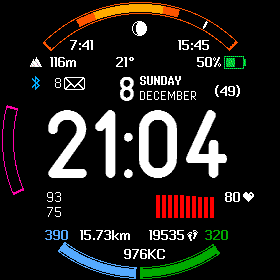

Garmin Connect IQ watch face for Garmin Fenix series
===============

Notes:
------

This face is inspired by "My Watch" watch face, by Benjamin Serant. I thik My Watch is the best watch face in existence, and i can't imagine using my Garmin watch wthout it. Unfortunately, Benjamin stopped updating his project. Some features (infamous "Sun data - need GPS usage" bug) are not working anymore, and there is no support for Fenix 6/6x series. So i decided to write my own watch face which would closely resemble "My Watch", and possibly make it open source.

Currently this face works only on watches with 240x240 or 280x280 round shape screens (Fenix 5/5x, Fenix 6/6x). I'll try to adjust it also for Fenix 3 218x218 screen in some unforeseeable future.

  

